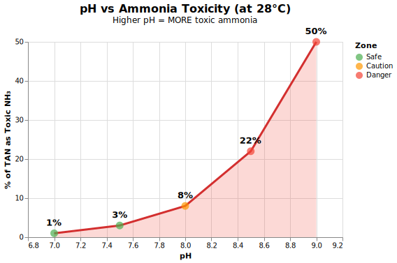
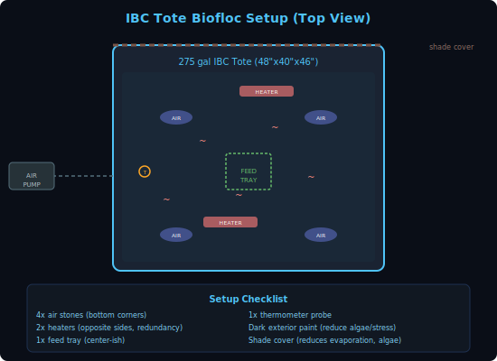

# Backyard Shrimp Farming Mega-Repo

> The most comprehensive open-source resource for raising shrimp at home. From a single 10-gallon cherry shrimp tank to a full biofloc vannamei operation in your garage.

  
  

  
  

---

## Why This Exists

There are hundreds of scattered YouTube videos, forum posts, and half-finished GitHub repos on shrimp farming. **None of them are complete.** This repo pulls everything into one place: species guides, farming methods, water chemistry, disease management, DIY equipment, IoT monitoring code, economics, legal requirements, and a curated list of every relevant GitHub repo we could find.

Whether you want to breed ornamental shrimp for profit or grow dinner-plate prawns in IBC totes, start here.

---

## Table of Contents

### Guides

| Guide | What You'll Learn |
|-------|-------------------|
| **Species** | |
| [Pacific White Shrimp (L. vannamei)](guides/species/vannamei.md) | The #1 farmed shrimp worldwide. Fast-growing, tolerant, delicious. |
| [Giant Freshwater Prawn (M. rosenbergii)](guides/species/rosenbergii.md) | True freshwater. Grows huge. No salt needed. |
| [Cherry Shrimp (Neocaridina)](guides/species/neocaridina.md) | Hardy ornamental. Breeds like rabbits. Great side income. |
| [Crystal/Bee Shrimp (Caridina)](guides/species/caridina.md) | Premium ornamental. High value. Requires precision. |
| **Farming Methods** | |
| [Biofloc Technology](guides/methods/biofloc.md) | Zero-exchange, bacteria-powered. The backyard standard. |
| [Recirculating Aquaculture (RAS)](guides/methods/ras.md) | Filtered, controlled, scalable. |
| [Aquaponics Integration](guides/methods/aquaponics.md) | Shrimp + plants. Dual harvest. |
| **Operations** | |
| [Water Quality Bible](guides/operations/water-quality.md) | Every parameter, every species. The numbers that keep shrimp alive. |
| [Disease Identification & Prevention](guides/operations/diseases.md) | Know the enemy. WSSV, EMS, vibriosis, and how to avoid them. |
| [Feeding & Nutrition](guides/operations/feeding.md) | Commercial feeds, DIY recipes, feeding schedules by growth stage. |
| [Economics & Business Planning](guides/operations/economics.md) | Real costs, real revenue, break-even analysis. |
| [Legal & Permits (USA)](guides/operations/legal.md) | State-by-state regulations, permits, shipping requirements. |
| [Supplier Directory](guides/operations/suppliers.md) | Where to buy PLs, feed, equipment, and salt. |

### Hardware & Code

| Project | Description |
|---------|-------------|
| [Arduino Water Monitor](hardware/arduino/) | ESP32 + pH/temp/DO sensors. Logs to SD and WiFi. |
| [Raspberry Pi Dashboard](hardware/raspberry-pi/) | Full monitoring dashboard with alerts and historical charts. |
| [Water Quality Calculator](tools/water-calc.py) | CLI tool: dosing calculator, stocking density, feed rates. |
| [Biofloc Carbon Calculator](tools/biofloc-calc.py) | Calculate carbon source dosing based on feed input. |

### Community & Resources

| Resource | Description |
|----------|-------------|
| [GitHub Repos (Awesome List)](resources/awesome-shrimp-farming.md) | Every shrimp/aquaculture repo on GitHub, categorized and verified. |
| [Video Resources](resources/videos.md) | Curated YouTube channels + search links for every topic. |
| [Community & Learning](resources/community.md) | YouTube channels, subreddits, forums, Facebook groups. |

---

## Quick Start: Which Path Are You On?

### "I want to grow shrimp to eat"
1. Read [Vannamei Guide](guides/species/vannamei.md) or [Rosenbergii Guide](guides/species/rosenbergii.md)
2. Pick your method: [Biofloc](guides/methods/biofloc.md) (recommended) or [RAS](guides/methods/ras.md)
3. Study the [Water Quality Bible](guides/operations/water-quality.md)
4. Check [Economics](guides/operations/economics.md) to budget your setup
5. Find a PL supplier in the [Supplier Directory](guides/operations/suppliers.md)
6. Build and cycle your system (allow 2-4 weeks)
7. Stock, feed, monitor, harvest in 90-120 days

### "I want to breed ornamental shrimp for profit"
1. Read [Neocaridina Guide](guides/species/neocaridina.md) (start here) or [Caridina Guide](guides/species/caridina.md)
2. Set up a [Clear Water / Planted Tank](guides/methods/ras.md#clear-water-setup)
3. Study the [Water Quality Bible](guides/operations/water-quality.md)
4. Start with one colony, learn to maintain stable parameters
5. Scale to 10-20 tanks over 6-12 months
6. Sell via AquaBid, r/AquaSwap, local fish stores

### "I want to automate and monitor everything"
1. Build the [Arduino Water Monitor](hardware/arduino/)
2. Set up the [Raspberry Pi Dashboard](hardware/raspberry-pi/)
3. Use the [Water Quality Calculator](tools/water-calc.py) for dosing
4. Browse the [Awesome List](resources/awesome-shrimp-farming.md) for more projects

---

## Visual Guides (12 SVG Diagrams)

All diagrams are dark-themed SVGs that render in GitHub markdown.

  
  

  
  

  
  

  
  

  

---

## The 10 Commandments of Backyard Shrimp Farming

1. **Thou shalt not skip the cycle.** 2-4 weeks of patience saves your entire stock.
2. **Thou shalt have backup aeration.** Power goes out, shrimp die in 2-4 hours. Battery backup. Always.
3. **Thou shalt not overfeed.** More shrimp die from overfeeding than underfeeding. Use feed trays.
4. **Thou shalt test water religiously.** Daily when starting. Weekly when stable. No exceptions.
5. **Thou shalt acclimate slowly.** Temperature: 15-20 min. Salinity: max 2 ppt/hr. pH: max 0.5/hr.
6. **Thou shalt buy SPF post-larvae.** Cheap PLs = disease = dead shrimp = wasted money.
7. **Thou shalt monitor alkalinity.** Biofloc eats alkalinity. It drops, pH crashes, shrimp die. Test 2x/week.
8. **Thou shalt not start in winter.** Unless you have a heated indoor setup. Heating costs crush beginners.
9. **Thou shalt start small.** One tank. 50 shrimp per cubic meter. Learn first, scale second.
10. **Thou shalt keep records.** Log everything. Water params, feed amounts, mortality. Data is how you improve.

---

## Contributing

This is a community resource. If you have experience with backyard shrimp farming, we want your knowledge.

- **Found a mistake?** Open an issue.
- **Have a technique that works?** Submit a PR.
- **Built cool hardware?** Add it to the hardware directory.
- **Know a repo we missed?** Add it to the [awesome list](resources/awesome-shrimp-farming.md).

---

## License

MIT License. Use this knowledge freely. Grow shrimp. Feed people. Make money. Have fun.
