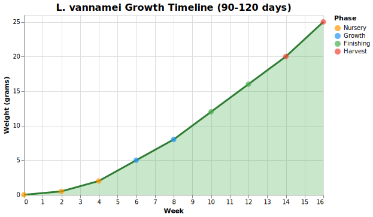

# Pacific White Shrimp (Litopenaeus vannamei)

> The most farmed shrimp species on Earth. Over 70% of global production. Fast-growing, tough, and the backbone of the backyard shrimp farming movement.

## Overview

| Attribute | Value |
|-----------|-------|
| Native range | Eastern Pacific (Mexico to Peru) |
| Max size | 23-25 cm, 30-35g |
| Market size | 15-25g (90-120 days) |
| Growth rate | 1-1.5 g/week under good conditions |
| Salinity tolerance | 0.5-40 ppt (euryhaline) |
| Temperature range | 26-33°C (79-91°F) |
| Lifespan | 18-24 months |
| Diet | Omnivorous (detritus, algae, zooplankton, pellet feed) |
| Global production | ~6 million tonnes/year |

L. vannamei dominates backyard farming because it's **fast, tolerant, and well-understood**. Most of the biofloc and IBC tote farming you see online is vannamei.

---

## Water Parameters

| Parameter | Optimal | Acceptable | Lethal / Critical |
|-----------|---------|------------|-------------------|
| Temperature | 28-32°C (82-90°F) | 26-33°C | <18°C or >35°C |
| pH | 7.5-8.5 | 7.0-9.0 | <6.5 or >10.0 |
| Salinity | 15-25 ppt | 0.5-40 ppt | Sudden change >5 ppt/hr |
| Dissolved Oxygen | >5 mg/L | >4 mg/L | <2 mg/L (lethal) |
| Ammonia (NH3) | <0.1 mg/L | <0.3 mg/L | >1.0 mg/L |
| Nitrite (NO2) | <0.5 mg/L | <1.0 mg/L | >5 mg/L |
| Nitrate (NO3) | <20 mg/L | <50 mg/L | >100 mg/L |
| Alkalinity | 120-150 mg/L CaCO3 | 80-200 mg/L | <40 mg/L (pH crash risk) |
| Calcium | 200-400 mg/L | >150 mg/L | <100 mg/L (molt failure) |
| Magnesium | 50-150 mg/L | >30 mg/L | <20 mg/L |
| Potassium | 100-200 mg/L | >50 mg/L | <30 mg/L (especially in FW) |
| Hardness (GH) | 150-300 mg/L | 100-500 mg/L | -- |

**The #1 killer**: Dissolved oxygen crashes. If your aerator stops and you have no backup, shrimp start dying within 2-4 hours in a biofloc system.

---

## Tank Setup

### Container Options

| Container | Volume | Cost | Pros | Cons |
|-----------|--------|------|------|------|
| IBC Tote | 275 gal (1040L) | $50-150 used | Cheap, stackable, easy to modify | UV degrades plastic, square corners collect waste |
| Rubbermaid Stock Tank | 100-300 gal | $80-350 | Round (better flow), durable | More expensive per gallon |
| Fiberglass Tank | 200-500 gal | $300-800 | Round, durable, professional | Heavy, expensive |
| Lined Raised Bed | Custom | $150-400 | Customizable, wood frame + EPDM liner | More work to build |
| Kiddie Pool | 100-200 gal | $20-60 | Cheap starter | UV degrades fast, flimsy |

### Setup Recommendations

- **Round or oval tanks preferred** - creates circular flow that pushes waste to center for easy removal
- **Dark colored** - reduces algae growth on walls, reduces shrimp stress
- **Minimum 200L** for learning, **1000L+** for production
- **Cover/shade** - prevents excessive algae, reduces evaporation, keeps birds out
- **Level surface** - critical for consistent water depth and drainage

### Aeration (Critical)

| System Size | Recommended Pump | CFM | Cost |
|-------------|-----------------|-----|------|
| 1 tank (275 gal) | Hygger or similar | 0.5+ CFM | $20-40 |
| 2-4 tanks | Hakko HK-40L | 1.2 CFM | $140-170 |
| 4-8 tanks | Hakko HK-80L | 2.5 CFM | $220-260 |

- Place 2-4 air stones per IBC tote (4" ceramic stones)
- Water should visibly "roll" - vigorous circulation
- **MUST have battery backup** - UPS or battery air pump ($30-80). Non-negotiable.

### Heating

- Rule of thumb: **5 watts per gallon**
- 275 gal IBC = 1375W needed (use 2x 500W + 1x 300W, or inline heater)
- Submersible heaters: cheap but can fail (always use 2 for redundancy)
- Inline heaters: better for larger systems ($60-120)
- **Insulate tanks** with foam board - saves 30-50% on heating costs

---

## The Grow-Out Cycle

### Day 0: Receiving Post-Larvae

Order **PL10-PL12** (10-12 days post-larvae) from a **SPF (Specific Pathogen Free)** hatchery. They arrive in bags with oxygen, shipped overnight.

**What to look for**:
- Active swimming (not sinking to bottom)
- Uniform size
- Clear/translucent bodies (not white or opaque)
- Responsive to light (should scatter when flashlight hits bag)
- No dead PLs in bag (a few is normal, many is bad)

### Acclimation Protocol (Critical - do NOT rush this)

1. **Float bag** in tank for 15-20 minutes (temperature equalization)
2. **Open bag**, add 1 cup of tank water every 10 minutes for 1-2 hours
3. **Test salinity** difference - adjust at max 2 ppt per hour
4. **Test pH** difference - adjust at max 0.5 per hour
5. **Test temperature** - should be within 1°C
6. **Release** into tank gently. Dim lights for 24 hours.
7. **Do not feed** for 12-24 hours after stocking.

**Failure to acclimate properly = mass die-off within 24-48 hours.** This is the #1 beginner mistake.

### Growth Timeline

| Week | Avg Weight | Stage | Feed Type | Protein % | Feed Rate (%BW/day) | Feedings/Day |
|------|-----------|-------|-----------|-----------|---------------------|-------------|
| 0-2 | 0.01-0.5g | Post-larval | Starter (crumble) | 40-42% | 10% | 6 |
| 2-4 | 0.5-2g | Early juvenile | Starter | 38-40% | 8% | 5 |
| 4-6 | 2-5g | Juvenile | Grower | 35-38% | 5% | 4 |
| 6-8 | 5-10g | Sub-adult | Grower | 35% | 4% | 3 |
| 8-12 | 10-20g | Growing | Finisher | 32-35% | 3% | 3 |
| 12-16 | 20-30g | Market size | Finisher | 30-32% | 2.5% | 2 |

### Harvest

- **When**: 90-120 days, when shrimp reach 15-25g (U/15 to 40-count size)
- **Best time**: Early morning when water is coolest
- **Method**: Lower water level, net out shrimp, or drain through harvest net
- **Stop feeding**: 24 hours before harvest
- **Ice bath**: Immediately place in ice water (kill + preserve quality)
- **Expected yield**: 3-6 kg per 1000L in biofloc, 70-90% survival rate

---

## Stocking Density

| System Type | Experience | Density | Shrimp per 275 gal IBC |
|-------------|-----------|---------|------------------------|
| Biofloc | Beginner | 50-100/m³ | 50-100 |
| Biofloc | Experienced | 100-200/m³ | 100-200 |
| Biofloc | Expert | 200-300/m³ | 200-300 |
| RAS | Any | 30-50/m³ | 30-50 |
| Outdoor pond | Any | 20-40/m² | N/A |

**Start at the low end.** Your first cycle is for learning, not maximizing production.

---

## Freshwater / Low-Salinity Culture

Vannamei CAN be grown in freshwater (0-3 ppt) with proper acclimation and mineral supplementation. This opens up backyard farming to people without access to marine salt.

### Acclimation to Freshwater

- **Slow** - reduce salinity by no more than 2 ppt per day
- Takes 7-14 days to go from 15 ppt to <3 ppt
- Best done at the hatchery or during nursery phase

### Critical Mineral Supplementation

Without salt, you must add individual minerals:

| Mineral | Target | Product | Dosing |
|---------|--------|---------|--------|
| Calcium (Ca) | >200 mg/L | Calcium chloride (CaCl2) | ~0.7g per liter for 200 mg/L |
| Magnesium (Mg) | >50 mg/L | Epsom salt (MgSO4) | ~0.5g per liter for 50 mg/L |
| Potassium (K) | >100 mg/L | Potassium chloride (KCl) | ~0.2g per liter for 100 mg/L |

### Expected Differences

- **Growth**: 10-20% slower than saltwater culture
- **Survival**: Similar if minerals are maintained
- **Feed conversion**: Slightly worse (FCR 1.5-2.0 vs 1.2-1.5)
- **Flavor**: Some report slightly different taste vs saltwater-raised

---

## Molting

Shrimp grow by molting (shedding their exoskeleton). This is the most dangerous time in their lives.

### Frequency

| Stage | Molt Interval |
|-------|--------------|
| Post-larval (<1g) | Every 2-3 days |
| Juvenile (1-5g) | Every 5-7 days |
| Sub-adult (5-15g) | Every 7-14 days |
| Adult (>15g) | Every 14-21 days |

### Signs of Upcoming Molt

- Reduced feeding
- Less active
- Shell appears loose or slightly separated at joints
- Slightly cloudy/white appearance

### Post-Molt Vulnerability

- Soft shell for 1-2 hours = vulnerable to cannibalism
- Shrimp hide during this time
- Providing shelter (biofloc itself, PVC pipes, mesh) reduces cannibalism

### Requirements for Successful Molting

- **Calcium**: >200 mg/L (critical for new shell hardening)
- **Magnesium**: >50 mg/L (assists calcium uptake)
- **Alkalinity**: >100 mg/L
- **Minerals**: Adequate GH/Ca/Mg
- **Low stress**: Stable parameters, no sudden changes

### Dealing with Failed Molts

Signs: Shrimp stuck in old shell, deformed new shell, death during molt.
Cause: Almost always mineral deficiency or sudden parameter change.
Fix: Test and supplement calcium/magnesium. Check alkalinity.

---

## Common Problems

| Problem | Symptoms | Likely Cause | Solution |
|---------|----------|-------------|----------|
| Mass die-off (sudden) | Many dead within hours | O2 crash, ammonia spike, disease | Check DO immediately, emergency water change, increase aeration |
| Mass die-off (day 1-3) | Deaths after stocking | Poor acclimation | Prevention only - acclimate properly next time |
| Not eating | Feed trays still full after 2 hours | Stress, poor water quality, pre-molt | Test all parameters, reduce feeding |
| Slow growth | Undersized for age | Low temperature, poor feed, overcrowding, low minerals | Check temp (28-32°C), upgrade feed quality, reduce density |
| Jumping out | Shrimp on floor | Poor water quality, overcrowding | Test parameters, add tank cover/screen |
| White spots on shell | Small white dots 0.5-2mm | WSSV (virus) - FATAL | No cure. Cull, disinfect, start over with SPF stock |
| Soft shell | Shell stays soft >24 hours | Low calcium/magnesium | Supplement minerals immediately |
| Cannibalism | Bite marks, missing appendages | Overcrowding, no shelter, molt vulnerability | Reduce density, add hiding spots, maintain biofloc |
| Red coloration | Shrimp turning reddish | Stress, disease, or about to die | Test all parameters, check for disease signs |
| Cloudy water (sudden) | Water turns milky | Bacterial bloom from overfeeding | Reduce feed, increase aeration, partial water change |

---

## Sourcing Post-Larvae (USA)

### Why SPF Matters

**SPF = Specific Pathogen Free**. These PLs are bred from broodstock certified free of major diseases (WSSV, AHPND, EHP, IHHNV, TSV, YHV). Non-SPF PLs are a gamble - they may carry pathogens that wipe out your entire crop. **The extra cost of SPF is insurance.**

### US Suppliers

| Supplier | Location | Min Order | Price | Notes |
|----------|----------|-----------|-------|-------|
| American Mariculture | St. James City, FL | ~1,000 | $0.05-0.10/PL | Largest US SPF supplier, ships nationwide |
| RDM Aquaculture | Fowler, IN | ~500 | $0.08-0.15/PL | Midwest location, good for central US |
| Shrimp Improvement Systems | FL | 5,000+ | $0.03-0.08/PL | Commercial-oriented |
| Texas A&M AgriLife | TX | Varies | Contact | Research/extension, limited availability |

### Shipping

- PLs ship overnight in insulated Styrofoam boxes with oxygen bags
- Best to receive Monday-Wednesday (avoid weekend transit)
- Open and acclimate immediately upon arrival
- Expect 1-5% DOA (dead on arrival) - more than 10% indicates a problem

---

## Seasonal Planning (Northern Hemisphere)

| Month | Activity |
|-------|----------|
| January-February | Plan, budget, order equipment, read guides |
| March | Set up tanks, start cycling water/biofloc |
| April | Establish biofloc (2-4 weeks), order PLs |
| May | Stock PLs when water is consistently >26°C |
| June-August | Peak growth season - feed, monitor, manage |
| September | Begin harvest planning |
| October | Final harvest before temperatures drop |
| November-December | Clean equipment, plan next season |

For **year-round indoor farming**: insulate tanks, budget $100-300/month for heating (climate dependent), and use a greenhouse or climate-controlled space.
